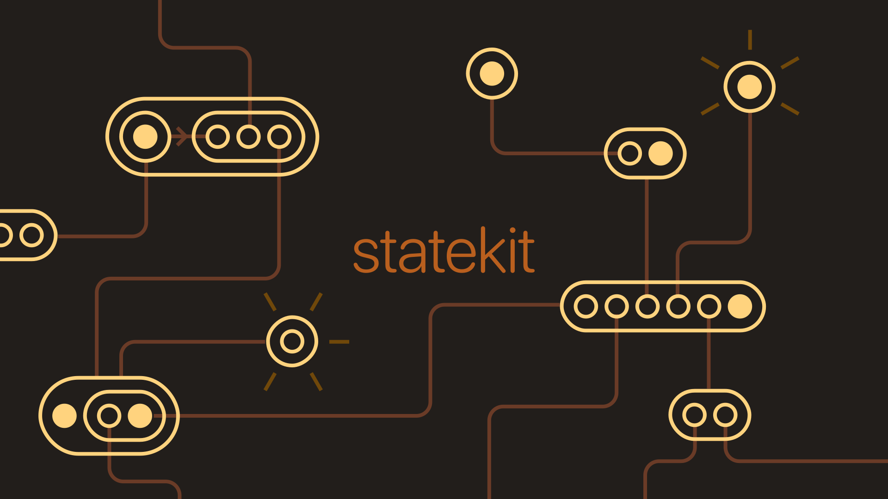

**statekit** is a simple toolkit of primitives for building apps and systems driven by data and events. Written from scratch in Typescript with no dependencies.

## Ways to use statekit

### Create a reactive, subscribable value with `signal`

This is the base reactive primitive.

```typescript
import { signal } from '@figureland/statekit'

const v = signal(() => 0)

v.set(0) // set value to 0

v.set('m') // ts error

v.on((newValue: number) => {
  // ...
})

v.get() // returns 0
```

### Managing incoming events and updating a `signal`

The signal provides a `use()` method you want to attach other dependencies to the signal. This is useful for managing listeners or other external data sources that feed into the signal.

```typescript
import { signal } from '@figureland/statekit'

const pointer = signal(() => ({ x: 0, y: 0 }))

const onMove = (e: PointerEvent) =>
  pointer.set({
    x: e.clientX,
    y: e.clientY
  })

const listener = window.addEventListener('pointermove', onMove)

pointer.use(() => window.removeEventListener('pointermove', onMove))

// When pointer is disposed, it will clean up the event listener as well
pointer.dispose()
```

### Combining multiple signals to create a derived Signal

You can create new signals derived from other signals or any sources that implements the `Subscribable` interface. You can use the first argument in the initialiser function. You can wrap this around any other signals, states or reactive objects from this library. It will pick up the dependencies and update automatically whenever they change.

```typescript
import { signal } from '@figureland/statekit'

const x = signal(() => 2)
const y = signal(() => 1)
const pos = signal((get) => ({
  x: get(x),
  y: get(y)
}))

post.on((newValue: { x: number; y: number }) => {
  // ...subscribes to the derived new value,
  // updates whenever x or y are updated
})
```

> Note: Be sure to wrap the whole signal dependency e.g. `get(mySignal)`, not `get(mySignal.get())`, which will produce errors.

### Checking for equality on Signal update

This library encourages you to decide yourself how a signal value has changed. You can do this using a custom equality check function. By default, signal does a basic shallow equality check to see if the value has changed.

```typescript
import { signal } from '@figureland/statekit'

const num = signal(() => 0, {
  equality: (a, b) => a === b
})
```

### Handling merged updates to Signal values

If you have an object complex nested state, you can provide your own custom merging function. By default, if the value is an object, it will use a simple `(a, b) => ({ ...a, ...b })` merge. More complex object-like variables such as `Map`, `Set`, or Arrays won't be merged unless you want them to. Something like [`deepmerge-ts`](https://github.com/RebeccaStevens/deepmerge-ts) could be a good way to do that.

```typescript
import { signal } from '@figureland/statekit'
import customMerge from './custom-merge'

const obj = signal(() => ({ x: 0, y: [{ a: 1, b: '2', c: { x: 1 } }] }), {
  merge: customMerge
})
```

### Creating a record of Signals with `signalObject`

This is a helper function that creates a record of multiple signals. You can subscribe to them as a collection or individually. Although you can store an object in a regular `signal()`, this is helpful for a complex stateful object where you might want to subscribe to both the whole object and individual keys.

```typescript
import { signalObject } from '@figureland/statekit'

const v = signalObject({
  arr: [1],
  point: {
    x: 0,
    y: 0
  },
  value: 'something'
})

// Update the whole object

v.set({ value: 'another' })
v.set({ arr: [2] })
v.set((a) => ({ arr: [...a.arr, 3] }))

// Subscribe to whole object
v.on((newValue: { arr: number[]; point: { x: number; y: number; value: string } }) => {
  // ...
})

// Use individual properties

v.key('arr').get() // [1]
v.key('point').get() // { x: 0, y: 0 }

// Set individual properties
v.key('point').set({ x: 1, y: 2 })
```

### Persisting a Signal's value to storage with `persist`

The persist will wrap a signal and persist its value to a storage API. The storage API is supplied as the second argument. This package provides a `typedLocalStorage` method that uses [superjson](https://github.com/blitz-js/superjson) to safely store data in LocalStorage (with a wider range of supported types than `JSON.stringify()`). If we want to persist in a type-safe way, we need to supply some extra information.

- `name` provides the path for the storage key. So, for example `['my','example','1']` would produce the key `my/example/1`.
- `validate` returns a boolean checking that the value in storage is of the same type as the signal.
- `interval` is a way of throttling the storage of values; useful if you are sending many updates to a signal and don't need to guarantee they are always up to date.

```typescript
import { type PersistenceName, typedLocalStorage } from '@figureland/statekit/typed-local-storage'
import { isNumber } from '@figureland/typekit/guards'

const exampleSignal = signal(() => 0)

persist(
  exampleSignal,
  typedLocalStorage({
    name: ['example', 'signal'],
    validate: isNumber,
    interval: 1000
  })
)
```

### Using `system` to organise a collection of Signals

Often you need to manage multiple signals in one place, disposing of them all together when cleaning up. Mr System comes in handy here.

```typescript
import { system, signal } from '@figureland/statekit'

const create = () => {
  const { use, dispose } = system()
  const one = use(signal(() => 0))
  const two = use(signal(() => [2]))
  const three = use(signal((get) => ({ v: get(one) })))

  return {
    one,
    two,
    three,
    dispose
  }
}
```

The system also provides a `unique` method. This is a basic utility that you can use to generate idempotent signals based on a key. So rather than creating multiple signals that compute the same value, you allow multiple subscriptions to the same source.

```typescript
import { system, signal } from '@figureland/statekit'

const create = () => {
  const { unique, dispose } = system()
  const subscribe = (id: string) => unique(id, () => signal(() => getSomething(id)))

  return {
    dispose,
    subscribe
  }
}
```

### Creating animations from Signals with `animated`

This is a helper function which provides the raw ingredients to create animated signal values.

<details><summary><strong>Rationale</strong></summary>

There are lots of great UI libraries for motion like Svelte's [motion](https://svelte.dev/docs/svelte-motion) and of course [react-spring](https://www.react-spring.dev/). [Motion One](https://motion.dev/) is also amazing. But they are very much based on animating HTML UI, and the animation management tends to happen within UI/framework code. Particularly in the case of React Spring I always struggle with remembering the API which seems to be extremely powerful but (in my opinion) very complicated but which is constantly battling between React's internal rendering and more declarative style of animation. This solution allows you to hoist the animation loop/update logic into separate state, which you could then subscribe to efficiently within your UI code.

Probably it could use the [Web Animations API](https://developer.mozilla.org/en-US/docs/Web/API/Web_Animations_API). But this part of the library is intended for a slightly different use case and I would suggest a battle-tested animation library like Motion or GSAP for that.

So the problem that this solved for me was:

- Allows readable, simple subscriptions to pieces of complex app state and turning them into animated values that transition smoothy.
- Very lightweight additional JS; ideally <1kb. (no need to do anything fancy with timelines etc). Bring your own easing curve and interpolation. Bring your own animation engine if you like.
- Wanting to produce derived animated values from that state
- Fine-grained control over a centralised animation loop
- Wanting to animate a mix of HTML UI, Canvas, SVG elements for data vis and update them all from the same source values
- As much as possible, not glued to one UI framework
- Not wanting to have a load of animation code in the front-end
- Not be bothered at all if its running on the server or in the browser

> **Here's a practical scenario:**
> I have a matrix that I'm using to transform a infinite canvas element. The canvas has some zoom controls. So the 'zoom level' is actually is actually hidden away inside the matrix [scale, 0, 0, scale, 0, 0]. If a user clicks the zoom in button, that should be an animated transition so it doesn't feel too jarring. But if a user directly pans the canvas, no animation should be applied as that would feel sluggish and unresponsive. So I want to keep my transform matrix as the source of truth, and then selectively animate or immediately change how the canvas is rendered in UI depending on user interaction.

It doesn't even attempt to solve the same problems that Motion One, React Spring solve which is not hitting the UI framework's internal reactivity system with 60 (or more) updates a second. This is intended for directly animating specific DOM elements or declaratively updating a WebGL/2D canvas.

</details>

```typescript
import { loop, animation, signal } from '@figureland/statekit'
import { easeInOut } from '@figureland/mathkit/easing'

// We create an instance of animation which in simple terms manages a set
// of signals that need to be updated based on a desired FPS
const engine = animation({ fps: 90 })

// You can manually update the engine tick by tick if you like
engine.tick(16)

// A nice lightweight solution is to wrap your engine in a loop() which automatically ticks
// the engine along with a requestAnimationFrame render loop. If there are no active
// animations, the loop pauses.

const { animated, events } = loop(animation({ fps: 60 }), { autoStart: true })

// Create a plain old signal here
const s = signal(() => ({ x: 0, y: 0 }))

// a is an 'animated mirror' of that signal. When that signal changes,
// will automatically tween towards the new target. You'll need to supply
// an interpolate function which tells the animated signal how to
// transition between different states.

// You can also supply an easing function if you want to control the curve
// of the motion.
const a = animated(s, {
  duration: 240,
  easing: easeInOut,
  interpolate: (f, t, a) => lerpVec2(f, f, t, a)
})

// To update the animation, update the source
s.set({ x: 10, y: -10 })

// Over 21.6 frames (@ 90fps) the animated signal
// will be automatically tweened.

// If you want to set the value immediately, just call the
// set() method on the animated signal rather than the source.
// It will finish any active animations immediately and stop
// updating.

a.set({ x: 1, y: 1 })
// Bear in mind it will start animating again if it detects that
// the source signal changes.

// You can also use the animation engine wherever else you might
// need it. One use case is if you have an animated engine which
// is rendering a canvas.

engine.on('tick', (f: number) => {
  // f is the delta since the last tick
  renderSomething()
})
```

### Using `history` to track a Signal's values over time

This is a very basic helper which maintains a log of past values of a `Subscribable`, alongside the timestamp when they were changed. It was mainly created as a tool for debugging. It could work for an undo/redo history if the value of signal is very basic.

```typescript
import { history, signal } from '@figureland/statekit'

const x = signal(() => 2)
const h = history(x, { limit: 3 })

x.set(3)
h.get() // [[1714414077814, 2]]

x.set(4)
h.get() // [[1714414077814, 2], [1714414077815, 3]]

x.set(5)
h.get() // [[1714414077814, 2], [1714414077815, 3], [1714414077816, 4]]

// You can revert to the previous version by calling restore() on the history
// with the associated timestamp.

x.get() // 5
h.restore()
x.get() // 4
h.get() // [[1714414077815, 3], [1714414077816, 4], [1714414077817, 5]]

h.restore(-2)
x.get() // 3
h.get() // [[1714414077816, 4], [1714414077817, 5], [1714414077818, 4]]
```

### Using `State` to manage your state using ES6 Classes

> This is likely going to be removed from future versions to reduce the footprint of this library.

This is a class-based extension of the `signalObject`. It's just a different pattern for a simple architecture where you are using classes heavily. Essentially it allows a pattern like this:

```typescript
import { State } from '@figureland/statekit'

type PointerState = {
  x: number
  y: number
}

export class Pointer extends State<PointerState> {
  constructor() {
    super({
      initial: () => ({ x: 0, y: 0 })
    })
  }

  // This is helpful for more complicated representations of state,
  // for example if there is internal logic or you want to associate
  // the state with additional methods
  public transform = () => {
    const { x, y } = this.state.get()
    return `transform: translateX(${x}px, ${y}px);`
  }
}

const pointer = new Pointer()

// You can also reset the state to initial arguments

pointer.reset()

// And subscribe to it like a signal or any other object
// which implements the Subscribable interface

const x2 = signal((get) => get(pointer.key('x')) * 2)
```

In practise, I've found that extending the `State` class ends up making codebases harder to reason about and so it's better to do this just to do this:

```typescript
import { signal } from '@figureland/statekit'

const initial = () => ({ x: 0, y: 0 })

class Pointer {
  public readonly state = signal(initial)

  public reset = () => {
    this.state.set(initial)
  }
  // and other methods
}

const pointer = new Pointer()

const x2 = signal((get) => get(pointer.state).x * 2)
```

### Notes on chaining

You might have noticed that this library is very chainable, e.g. you might end up doing:

```typescript
const mynumber = use(
  history(
    persist(
      engine.animated(
        signal(() => 0),
        animationOptions
      ),
      persistenceOptions
    )
  )
)
```

Be careful though! Firstly my personal opinion is these dense chains of functions are quite hard to read. Also this example won't work because history doesn't return the original signal you provide as an argument, unlike the other methods. It's also best to think about the order of chaining as well. An opinionated alternative:

```typescript
const { use } = system()
const engine = use(loop(animation({ fps: 60 }), { autoStart: true }))

const myNumber = use(signal(() => 0))
const h = use(history(myNumber, { limit: 5 }))

// You only want to persist the target values to LocalStorage, not the
// intermediate tweened versions from its animated mirror.
use(persist(myNumber, persistenceOptions))

// Keep the animated value separate because it will produce a lot of
// events so you want to use it selectively
const a = use(engine.animated(myNumber, animationOptions))
```

## Scripts

### Install

```bash
bun install
```

### Test

```bash
bun test
```

### Build

```bash
bun run build
```

### Prior art

This codebase draws on a lot of previous ideas in other projects, like:

- [Solid Signals](https://www.solidjs.com/tutorial/introduction_signals)
- The brilliant [@thi.ng/rstream](https://github.com/thi-ng/umbrella/tree/develop/packages/rstream)
- [RxJS](https://rxjs.dev/)
- [Jotai](https://jotai.org/) and [Zustand](https://github.com/pmndrs/zustand)
- And the [TC39 Signals proposal](https://github.com/tc39/proposal-signals)

You should use those projects! They will make you happy and/or rich. This is a project for learning and building a specific sharp tool that manages state in an opinionated way.
